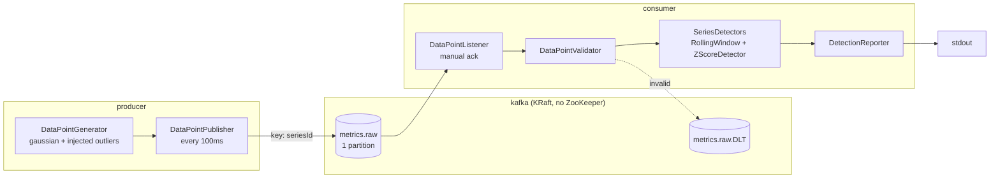
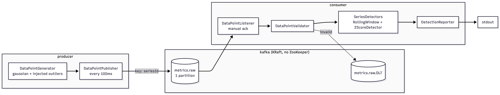

# Real-Time Data Anomaly Detector

A producer publishes a stream of numerical readings to Kafka; a consumer scores each one against a rolling
window of the readings before it and flags the outliers.

Three services, orchestrated by Docker Compose. Nothing to install beyond Docker.

```bash
docker compose up --build
```

From a cold start — no images, no cached layers — this takes about a minute, and the broker is health-gated
so the services wait for it rather than crash-looping. The consumer then prints one line per reading:

```
[2026-08-29T17:39:53.769Z] Data point: 47.89 | Status: OK | Z-score: 0.30
[2026-08-29T17:39:53.866Z] Data point: 54.53 | Status: OK | Z-score: 1.27
[2026-08-29T17:39:39.666Z] Data point: 10.01 | Status: ANOMALY DETECTED! | Z-score: 10.07 | ALERT: Significant deviation detected.
```

Anomalies begin appearing once the window has filled, about five seconds in.

---

## Architecture





| Service | Role |
| --- | --- |
| `kafka` | Single-node broker in KRaft mode. Health-gated; its log lives on a named volume. |
| `producer` | Generates readings and publishes them every 100 ms. |
| `consumer` | Subscribes, scores each reading, prints the result. |

---

## The detection logic

The consumer keeps the most recent `N` readings per series. For each new reading `x`, it computes the mean
`μ` and sample standard deviation `σ` of that window and takes

```
Z = |x − μ| / σ
```

flagging the reading when `Z` exceeds the threshold. Defaults are `N = 50` and `Z > 3`, both configurable.

Four choices in there are worth stating plainly, because each one changes the answer:

**The reading is scored against the window before it joins it.** A point included in its own baseline pulls
the mean toward itself and inflates the deviation. It also caps the result: for a point inside an n-sample
window the Z-score cannot exceed `(n−1)/√n` — about 6.93 at n = 50 — no matter how extreme the reading.
Scoring against the prior window removes the ceiling; the live stream regularly produces scores of 8 to 12.

**Sample standard deviation, dividing by `n−1`.** The window is a sample of an ongoing process, not a
complete population.

**A flagged reading is not admitted to the window.** Letting anomalies in raises σ and masks the next one.
The cost, which is real: a genuine *level shift* — the metric settling at a new normal — is then rejected
indefinitely, because the window never adapts to it. Handling that properly means change-point detection,
not a Z-score.

**Scoring waits for a full window.** A single value has no deviation and a handful gives an unstable one.
Readings arriving during warm-up are still printed, in the normal format with a Z-score of `0.00`.

### The false-positive rate, measured rather than assumed

The textbook figure for `Z > 3` is **0.27%** of readings — but that is the rate when μ and σ are *known*.
They are not; they are estimated from 50 samples. Measured over 200,000 generated readings
(`DetectionQualityTest`), the detector's real rate is about **0.55%** — roughly twice the textbook number.
Two effects account for it, and they can be separated by measurement:

| Configuration | False-positive rate |
| --- | --- |
| Textbook, σ known | 0.27% |
| σ estimated from a 50-point window | 0.44% |
| …and flagged readings held out of the window | 0.55% |

Estimating σ from a small sample fattens the tail the way Student's t does. Holding anomalies out of the
window — the choice described above — then keeps σ slightly tighter than the truth, which flags a few more
readings still. It is a real cost of that decision, and small next to the masking it prevents.

Over the same 200,000 readings, **recall was 1.000** — every injected anomaly caught, none missed — at a
**precision of 0.77**. Roughly a quarter of the alerts are false alarms. That is the honest trade at this
threshold, and it is why the alert-fatigue point below is the first thing in Up Next.

---

## Configuration

Every value has a working default, so `docker compose up` needs no `.env` file. Override through the
environment in `docker-compose.yml`.

**Producer**

| Variable | Default | Meaning |
| --- | --- | --- |
| `KAFKA_BOOTSTRAP_SERVERS` | `kafka:9092` | Broker address |
| `PRODUCER_TOPIC` | `metrics.raw` | Destination topic |
| `PRODUCER_SERIES_ID` | `sensor-1` | Partition key and series identity |
| `PRODUCER_INTERVAL_MS` | `100` | Publish interval |
| `PRODUCER_MEAN` | `50.0` | Centre of the normal baseline |
| `PRODUCER_STANDARD_DEVIATION` | `5.0` | Spread of the baseline |
| `PRODUCER_ANOMALY_PROBABILITY` | `0.02` | Share of readings replaced by an outlier |
| `PRODUCER_ANOMALY_MIN_SIGMA_MULTIPLIER` | `6.0` | Nearest an injected outlier sits to the mean |
| `PRODUCER_ANOMALY_MAX_SIGMA_MULTIPLIER` | `12.0` | Furthest it sits |
| `PRODUCER_SEED` | *(random)* | Fix it to make a run reproducible |

**Consumer**

| Variable | Default | Meaning |
| --- | --- | --- |
| `KAFKA_BOOTSTRAP_SERVERS` | `kafka:9092` | Broker address |
| `CONSUMER_TOPIC` | `metrics.raw` | Source topic |
| `CONSUMER_WINDOW_SIZE` | `50` | Readings held per series |
| `CONSUMER_THRESHOLD` | `3.0` | Z-score above which a reading is flagged |
| `CONSUMER_MINIMUM_SAMPLES` | `50` | Readings required before scoring starts |

Outliers are injected at 6–12σ, comfortably past a threshold of 3, so an injected anomaly is reliably
caught and the demonstration does not hinge on a marginal call. They are two-sided: `|x − μ|` catches a
sensor dropping as readily as one spiking, and roughly half of them do.

---

## Why Kafka

The brief suggests RabbitMQ, Redis Pub/Sub, or SNS/SQS via LocalStack — as examples, marked "e.g.", not as
a closed list. "Lightweight" is read here as operational burden, which a single KRaft container with no
ZooKeeper meets.

The reason for choosing it is **replay**, not scale:

1. **Tuning a detector needs the same data twice.** `N` and the threshold are not knowable in advance; you
   arrive at them by trying values and comparing. Kafka retains the log, so resetting the consumer group's
   offsets re-runs the detector over byte-identical data under new parameters. A queue destroys on consume:
   to re-test you must regenerate the stream, and being random it is *not the same stream*.
2. **An alert is a claim about data, and retention keeps the evidence.** "Why did this fire?" is a routine
   question for anything that raises alarms, and unanswerable once the message is gone.
3. **Ordering is a structural, per-partition guarantee.** A rolling window is order-sensitive — the same
   readings in a different order give different means and different alerts.
4. **Consumption is pull-based and lag is a first-class metric.** The producer is never blocked by a slow
   detector, and "am I keeping up?" — the operational question for anything real-time — is answered natively.

**What it costs, stated plainly.** Kafka is the heaviest of the four options: it needs a capped heap and
several seconds to become ready, which forces a healthcheck and `depends_on: condition: service_healthy`
for a clean first run. **At the scope actually submitted — one series, one partition, one consumer —
RabbitMQ would serve this functionality equally well.** The Kafka-specific value here is replay and
retention, not throughput. It is worth knowing that RabbitMQ has offered Streams since 3.9, which is
log-structured and replayable; "RabbitMQ cannot replay" would be false. Kafka's implementation is more
mature and its consumer-group and partition model is the one the scaling story below is built on.

Notably **not** used: Kafka Streams. Its windowing DSL is entirely time-based — tumbling, hopping, sliding,
session — while this window is *count*-based, the last N readings. There is no such construct in the DSL,
so implementing it means the Processor API wrapping the same ring buffer. Streams would add durable window
state and exactly-once, neither of which the brief asks for, at the cost of internal-topic replication
settings on a single broker and RocksDB's glibc requirement. It is the right tool for the scaled-up version
and the wrong one here.

---

## Demonstrating replay

Both properties below are also asserted as tests in `ReplayIntegrationTest`, so they hold in CI, not just
in a terminal.

**Nothing is lost while the consumer is down.**

```bash
docker compose stop consumer          # the producer keeps publishing
docker compose start consumer         # resumes from its committed offset and catches up
docker compose exec kafka /opt/kafka/bin/kafka-consumer-groups.sh \
  --bootstrap-server localhost:9092 --describe --group anomaly-detector
```

**The same data, re-scored under different parameters.** This is the argument for the broker:

```bash
docker compose stop consumer
docker compose exec kafka /opt/kafka/bin/kafka-consumer-groups.sh \
  --bootstrap-server localhost:9092 --group anomaly-detector \
  --topic metrics.raw --reset-offsets --to-earliest --execute
docker compose start consumer         # re-runs the detector over identical readings
```

Change `CONSUMER_THRESHOLD` in `docker-compose.yml` before restarting and the same stream is scored under
the new threshold — an A/B comparison on identical input, which a queue cannot give you.

## Handling bad data

Anything the detector cannot score goes to `metrics.raw.DLT` rather than stalling the partition:

```bash
echo 'not json at all' | docker compose exec -T kafka \
  /opt/kafka/bin/kafka-console-producer.sh --bootstrap-server localhost:9092 --topic metrics.raw

docker compose exec kafka /opt/kafka/bin/kafka-console-consumer.sh \
  --bootstrap-server localhost:9092 --topic metrics.raw.DLT --from-beginning --max-messages 1
```

Unparseable payloads arrive there as their original bytes; payloads that parsed but failed validation — a
missing value, a non-finite one, no series id — arrive as JSON. The detector keeps processing good readings
throughout.

The case worth singling out is a payload that is *well-formed but missing its `value`*. The consumer models
that field as a boxed `Double`, so it arrives as `null` and is rejected. Had it been a primitive `double`,
Jackson would have bound a plausible `0.0` — which, against a window centred on 50, scores `Z = 10` and
would be reported as a detection. A schema fault would have been indistinguishable from a finding.

---

## Layout

```
producer/     self-contained Gradle project, its own Dockerfile
consumer/     self-contained Gradle project, its own Dockerfile
docs/         decisions.md, task-breakdown.md
docker-compose.yml
```

The two services are independent Gradle builds in one repository — a repository boundary is not a build
boundary. Each is its own Docker build context, and neither depends on a shared artifact: the consumer
defines its own view of the message and ignores fields it does not model. That keeps their deployments
independent, and it makes the producer's ground-truth `injectedAnomaly` flag structurally unreachable from
the detection path rather than merely off-limits by convention.

## Building and testing

```bash
cd producer && ./gradlew build      # or consumer
```

Tests run against an embedded Kafka broker, so no Docker is needed for the suite. They cover the rolling
window and Z-score arithmetic, the exact output format including its locale trap, replay and delivery
guarantees, and dead-letter routing.

## Design decisions

[`docs/decisions.md`](docs/decisions.md) records every significant choice, what was rejected, and what each
one costs — including the ones with real downsides.

---

## Up Next

What I would add to run this for real, and what is missing today.

### Tooling

CI is the first gap worth closing: a GitHub Actions workflow building and testing both services on every
push, and starting the stack with `docker compose up --wait` so the one requirement that cannot be allowed
to break is checked rather than trusted. On top of that:

- **Coverage and static analysis** — JaCoCo with a threshold that fails the build, plus ErrorProne or
  SpotBugs. Spotless with google-java-format to stop style being a review topic.
- **Schema management** — the message contract is currently a shared understanding, enforced only by the
  consumer ignoring what it does not recognise. The scaled-up answer is schema-first code generation from
  Avro or Protobuf against a registry — Apicurio (Apache 2.0) rather than Confluent's Community-licensed
  one — which turns compatibility into a CI check instead of a convention. A shared DTO jar is *not* the
  answer: it couples the two deployments into lockstep releases.
- **Observability** — Actuator for health and readiness, Micrometer to Prometheus, and a Grafana panel of
  consumer lag, detection rate and end-to-end latency. Latency is already available: the producer's
  timestamp travels with each reading, so it can be compared against processing time, which is also the
  event-time versus processing-time distinction this design otherwise glosses over.
- **Container and dependency scanning** — Trivy on the built images and Dependabot on the two Gradle files,
  which also guards against the two projects' Boot and Java versions drifting apart, something nothing
  enforces today.
- **Testcontainers** for a test against a real broker rather than the embedded one, closer to production
  behaviour than `@EmbeddedKafka` can be.

### Would it run on Kubernetes?

Yes, and most of it is routine: a Deployment per service, ConfigMaps and Secrets instead of environment
literals, resource requests and limits, liveness/readiness/startup probes via Actuator, Helm or Kustomize
to template environments, and either Strimzi or a managed Kafka rather than a broker in a pod.

**The interesting part is not the manifests — it is that the rolling window is per-instance, in-memory
state.** Scale the consumer to three replicas and Kafka splits the partitions between them, so each pod
holds a fragment of the stream. Keying by `seriesId` is what makes that correct: every reading for a series
lands on one partition and therefore one pod, so no window ever sees an interleaving of two sources. But on
any rebalance — a deploy, a crash, an autoscale — the in-memory window is lost and the pod that picks up
the partition re-warms blind, scoring nothing for its first `N` readings.

Three ways out, in increasing order of effort: accept the warm-up gap and make it visible as a metric;
externalise the window to Redis so a restarting pod can reload it; or move to a Kafka Streams Processor-API
state store, where a changelog topic restores it automatically. That last one is where Streams genuinely
earns its place — note that even then the DSL's time-based windowing does not fit a count-based window, so
the ring buffer stays exactly as written.

Also needed before it is really production-ready: a PodDisruptionBudget so a node drain cannot take every
consumer at once, and an HPA driven by consumer lag rather than CPU, which for a queue consumer is the
metric that actually reflects load.

### The most obvious missing requirements

Ordered by how much they would bother me in production:

1. **The alert goes nowhere.** It is a line on stdout. A real detector publishes to an alerts topic or calls
   a webhook, and deduplicates: at 2% injection this would page someone every few seconds. Alert fatigue
   would make it useless within a day.
2. **No persistence of findings.** Anomalies are printed and forgotten, so there is no history to ask "how
   often does this fire?" or "did last Tuesday's incident show up here?"
3. **No security.** The broker is plaintext with no authentication. Real deployments need TLS and SASL, and
   the consumer would need credentials from a Secret.
4. **The threshold is a constant, not a conclusion.** `Z > 3` came from the brief. In production it should
   be derived from labelled data and reviewed as the metric's behaviour changes — which is exactly what
   replay makes possible.
5. **No handling of drift or late data.** A slow ramp is never flagged, because the window drifts with it.
   Out-of-order or late readings are scored in arrival order regardless of their timestamps, which for a
   window this small can matter.
6. **A single point of failure by construction.** One partition means one consumer. That is the right
   configuration for one order-sensitive series, but it means the detector has no redundancy — a consumer
   outage is a detection outage, mitigated only by the fact that replay lets it catch up afterwards.
7. **No backpressure story beyond Kafka's own.** If the detector fell permanently behind, lag would grow
   without bound until retention dropped data. Detecting that needs the lag alerting mentioned above.
8. **The detector is not idempotent — measured, and it matters less than it sounds.** Delivery is
   at-least-once, so a redelivered reading can enter the window twice. Replaying 60,000 readings with 1% of
   them redelivered — far above any realistic rate — changed **30 detection verdicts out of 59,950, or
   0.05%** (`DuplicateDeliveryImpactTest`). A duplicated *anomaly* has no effect at all, because flagged
   readings are never admitted to the window; the worst a duplicated normal reading can do is shift the mean
   by 0.12σ.

   Deduplicating on the message id is the obvious fix, and the id is already in the payload — but an
   in-memory set would not fire when it is actually needed. Redelivery follows a crash or a rebalance: after
   a crash the process restarts with an empty dedup set *and an empty window*, so there is nothing to skew;
   after a rebalance the partition moves to an instance whose set is equally empty. Such a set would only
   catch duplicates arriving within one process's lifetime, which in practice means producer retries — and
   the idempotent producer already prevents those. Real deduplication needs shared, durable state, which is
   the same problem as the in-memory window above and has the same answers.

   The duplicate's real cost is not statistical, it is a repeated line of output — and a repeated *alert*.
   That belongs with the missing alert sink in point 1, as suppression and deduplication at the point of
   notification rather than at the point of measurement.
